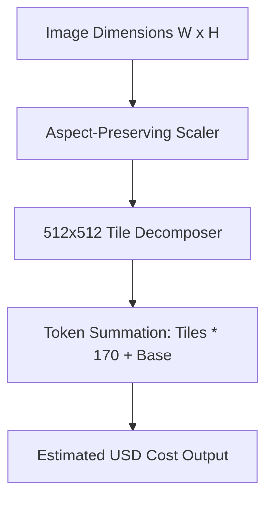

# genpark-image-token-cost-calculator-skill

Vision token budget and tile decomposition estimator for OpenAI GPT-4o, Claude 3.5 Sonnet, and Gemini multimodal architectures.

## Architecture

## Features
- **Accurate Tile Math**: Replicates exact tiling logic used by model API providers.
- **Detail Toggle**: Supports high and low detail vision modes.
